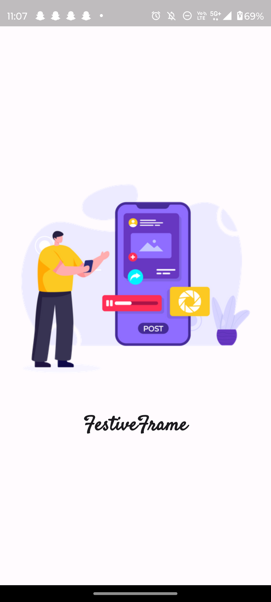
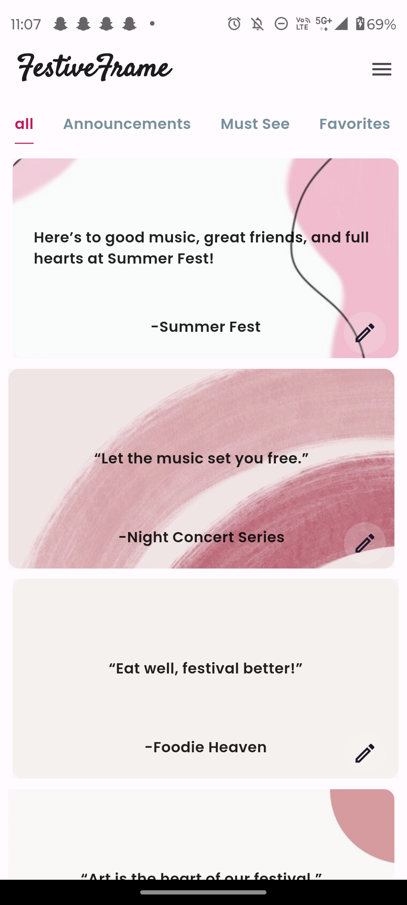
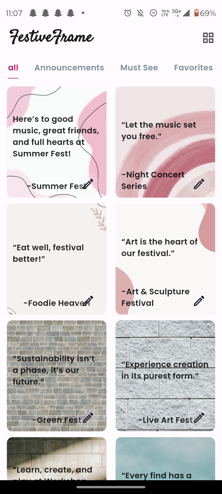
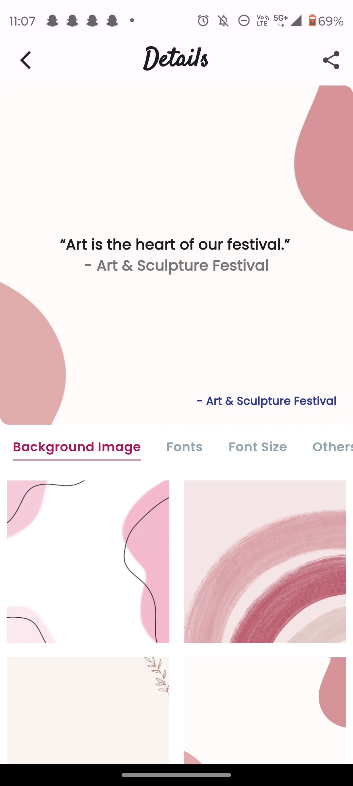
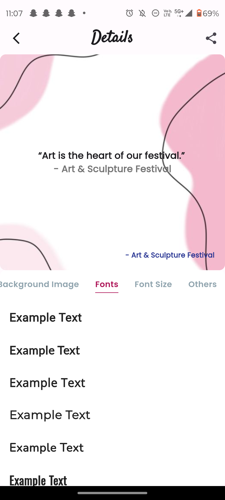
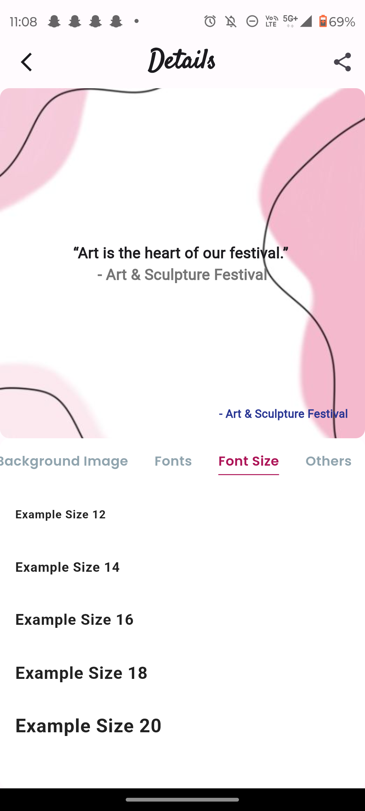
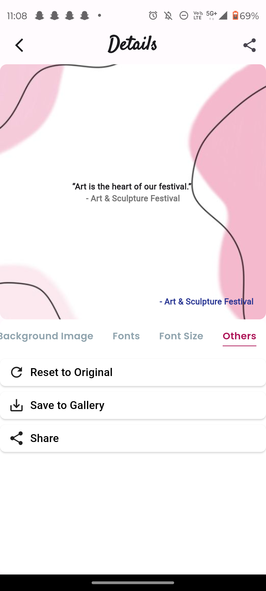
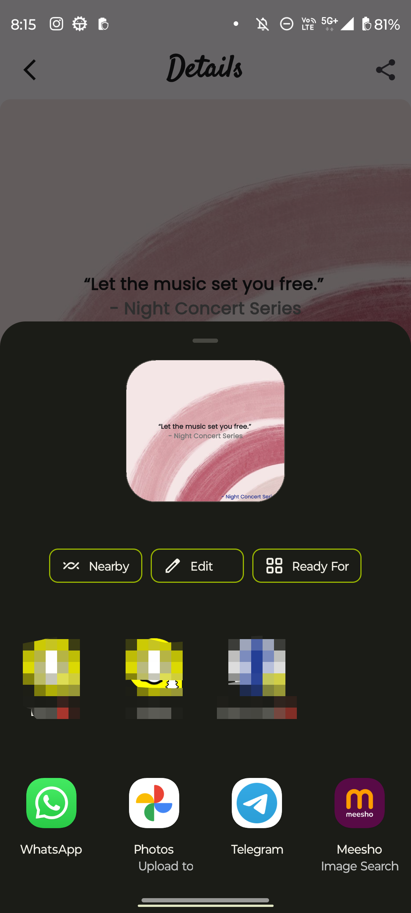
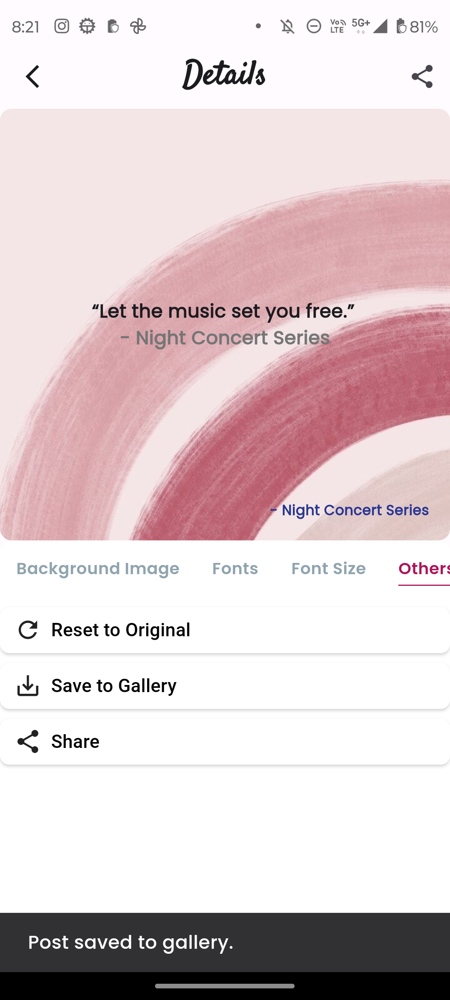

# Festival Post App

The Festival Post App is a dedicated mobile application designed to customize and enhance festival-related posts. It provides a variety of editing tools and features, making it easy for users to personalize their posts with style and creativity.

## Features

- **Toggle Layout**: Users can switch between different post layouts directly from the home screen, offering flexibility in how content is displayed.

- **Splash Screen**: A visually appealing splash screen that introduces users to the app.

- **Post Details Screen**: A feature-rich screen where users can customize their festival posts with various options:
    - **Font Style**: Change the font style of the text in the post.
    - **Font Size**: Adjust the size of the text for better visibility and aesthetics.
    - **Font Weight**: Alter the thickness of the text to highlight or emphasize specific parts of the post.
    - **Background Image**: Select from a range of background images to enhance the post's appearance.

- **Additional Functionalities**:
    - **Share**: Share your customized festival post on social media or with friends.
    - **Reset to Default**: Revert all changes and return to the original post settings.
    - **Save to Gallery**: Save your creations directly to your device's gallery for future use.

## Screenshots

**Series of screenshots that demonstrate the app's functionality and UI:**  
<table style="border-collapse: collapse; width: 100%;">
<tr>
<th colspan="4" style="text-align: center; border: 0;">Screenshots</th>
</tr>
<tr>
<td style="width: 250px; border: 0;">

#### ✨ Splash Screen


</td>
<td style="width: 220px; border: 0;">

#### ✨ Home Screen View 1


</td>
<td style="width: 220px; border: 0;">

#### ✨ Home Screen View 2


</td>
<td style="width: 220px; border: 0;">

#### ✨ Post Detail Screen


</td>
</tr>
<tr>
<td style="width: 220px; border: 0;">

#### ✨ Post Detail Screen


</td>
<td style="width: 220px; border: 0;">

#### ✨ Post Detail Screen


</td>
<td style="width: 220px; border: 0;">

#### ✨ Post Detail Screen


</td>
<td style="width: 220px; border: 0;">

#### ✨ Post detail screen


</td>
</tr>
<tr>
<td style="width: 220px; border: 0;">

#### ✨ Post Detail Screen


</td>

<!-- <td style="width: 220px; border: 0;">
<!-- Placeholder for alignment or future content -->
<!-- </td> -->
<!-- <td style="width: 220px; border: 0;"> -->
<!-- Placeholder for alignment or future content -->
<!-- </td> --> 
</tr>
</table>

## Video Demo

Below is a GIF demonstrating the app's workflow and usage:


## How to Use

1. **Starting the App**:
    - Launch the app and enjoy the quick loading splash screen.
    - Navigate through the home screen to access various functionalities.

2. **Customizing the Post**:
    - On the home screen, toggle different layouts to find the perfect arrangement for your post.
    - Enter the post details screen by selecting a post.
    - Use the editor tools to change the font style, size, weight, and background image.

3. **Saving and Sharing**:
    - After customization, you can save your post to the gallery by tapping the 'Save to Gallery' button.
    - Share your creation directly from the app using the 'Share' button.
    - Reset any changes if needed with the 'Reset to Default' option.

## Installation

To run the Festival Post App on your local machine, follow these steps:

```bash
git clone https://github.com/jagritixjha/festival-post-app.git
cd festival-post-app
flutter pub get
flutter run
